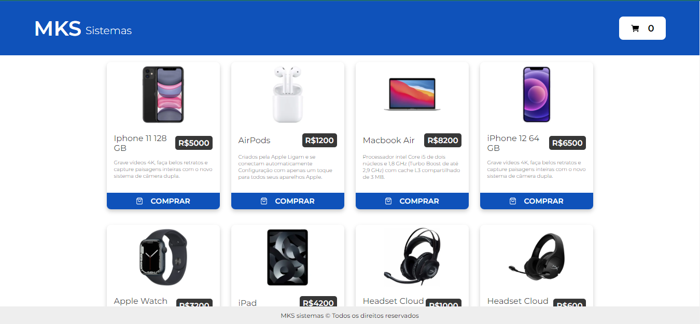
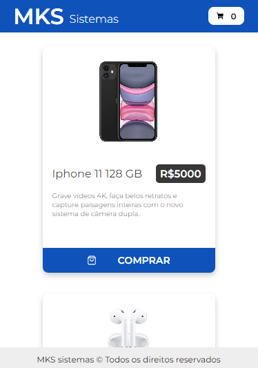
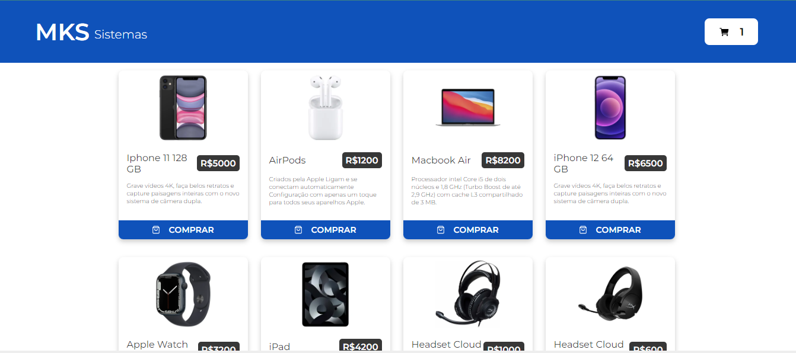
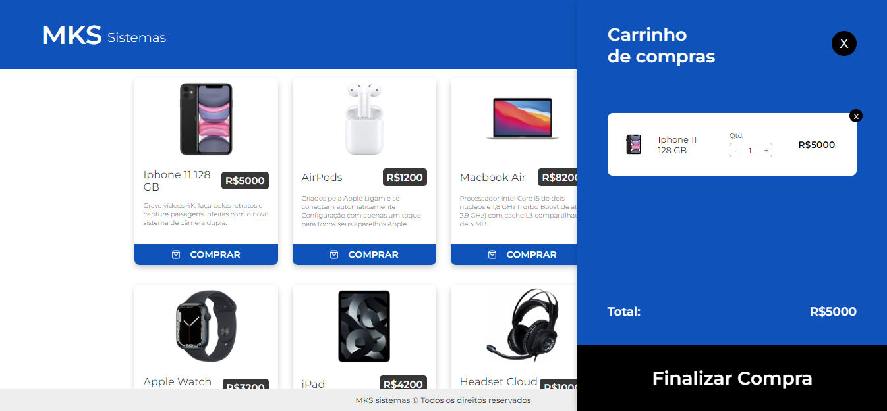
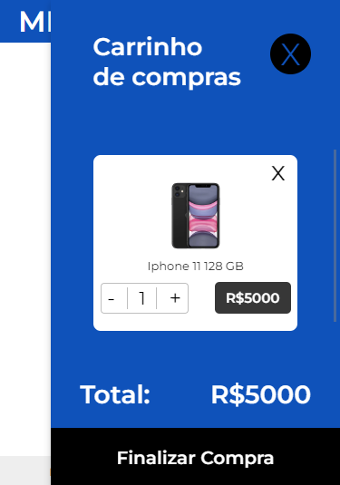
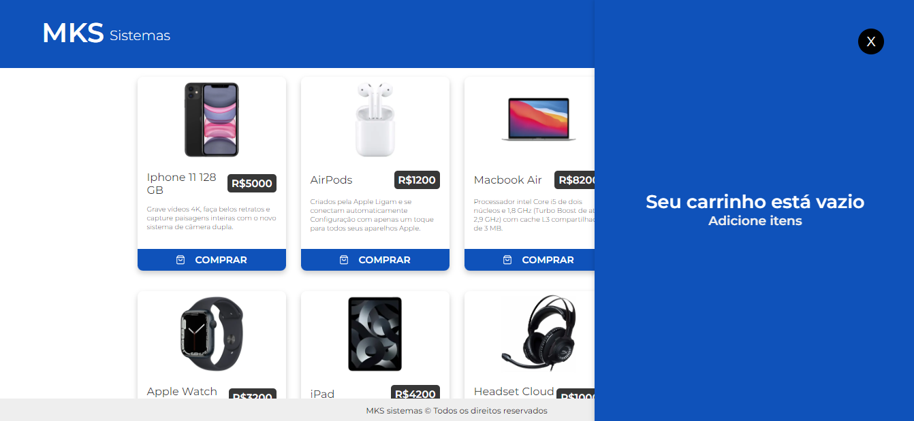
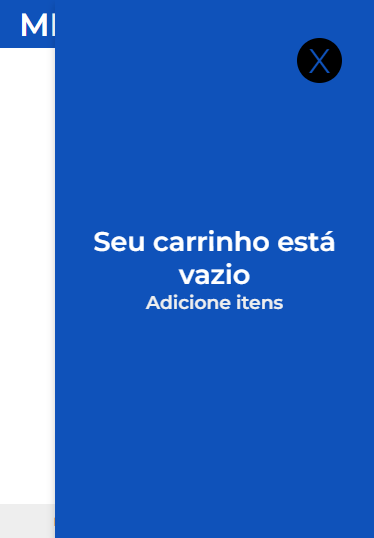

## Sobre o projeto
Aplicação feita em um desafio técnico no processo seletivo da MKS Desenvolvimento de Sistemas onde a tarefa era desenvolver um projeto de e-comerce consumindo a [API Rest de produtos](https://mks-frontend-challenge-api.herokuapp.com/api-docs/) disponibilizada pela empresa.
<div align="center"> 
    Desktop
  
</div>
<div align="center"> 
    <p>Mobile</p>
  
</div>
<br/>

### Stacks
<details>
  <summary>Client</summary>
  <ul>
    <li><a href="https://nextjs.org/">Next.js</a></li>
    <li><a href="https://www.typescriptlang.org/">Typescript</a></li>
    <li><a href="https://styled-components.com/">Styled Components</a></li>
    <li><a href="https://redux-toolkit.js.org/">Redux Toolkit</a></li>
     <li><a href="https://jestjs.io/pt-BR/">Jest</a></li>
  </ul>
</details>

### Funcionalidades

- Adicionar produtos ao carrinho;
- Aumentar ou diminuir a quantidade dos produtos selecionados;
- Remover itens do carrinho;

## Começando

### Pré-requisitos

Antes de começar, você precisará ter instalado em sua máquina as seguintes ferramentas: [Git](https://git-scm.com/), [Node.js](https://nodejs.org/en/) e [Typescript](https://www.typescriptlang.org/).
   
### Rodar testes

Para rodar testes, escreva o seguinte comando

```bash
  npm run test
```

### Rodar localmanente

Clone o projeto

```bash
  git clone https://github.com/zirtaebn/mks-frontend-challenge.git
```

Vá para o diretório do projeto

```bash
  cd mks-frontend-challenge
```

Instale as dependências

```bash
  npm install
```

Inicie o servidor em modo de desenvolvimento

```bash
  npm run dev
```

## Uso

### Adicione um produto ao carrinho clicando em "COMPRAR"
<div align="center">
    Desktop
    
</div>

<div  align="center">
    <p>Mobile</p>
    
</div>


Clique no carrinho para ver o produto selecionado e aumente ou diminua a quantidade do mesmo
<div  align="center">
    Desktop
    
</div>
<div  align="center">
    <p>Mobile</p>
    
</div>


Aperte no x para remover o produto do carrinho
<div  align="center">
    Desktop
    
</div>
<div  align="center">
    <p>Mobile</p>
    
</div>


## Contribuição

<a href="https://github.com/zirtaebn/weather-app--test/graphs/contributors">
  
</a>
</br>
Contribuições são sempre bem vindas!

## Contato

Beatriz Sant'Anna - [@zirtaebn](https://twitter.com/zirtaebn) - zirtaebndev@gmail.com

Link do projeto: [https://github.com/zirtaebn/mks-frontend-challenge](https://github.com/zirtaebn/mks-frontend-challenge)


## Reconhecimentos

Recursos e bibliotecas úteis que utilizei no projeto.
 - [API Rest de produtos](https://mks-frontend-challenge-api.herokuapp.com/api-docs/)
 - [Axios](https://axios-http.com/ptbr/)
 - [React Testing Library](https://testing-library.com/docs/react-testing-library/intro/)
 - [React Icons](https://react-icons.github.io/react-icons/)
 - [Redux Persist](https://www.npmjs.com/package/redux-persist)
 - [Redux Thunk](https://www.npmjs.com/package/redux-thunk)
